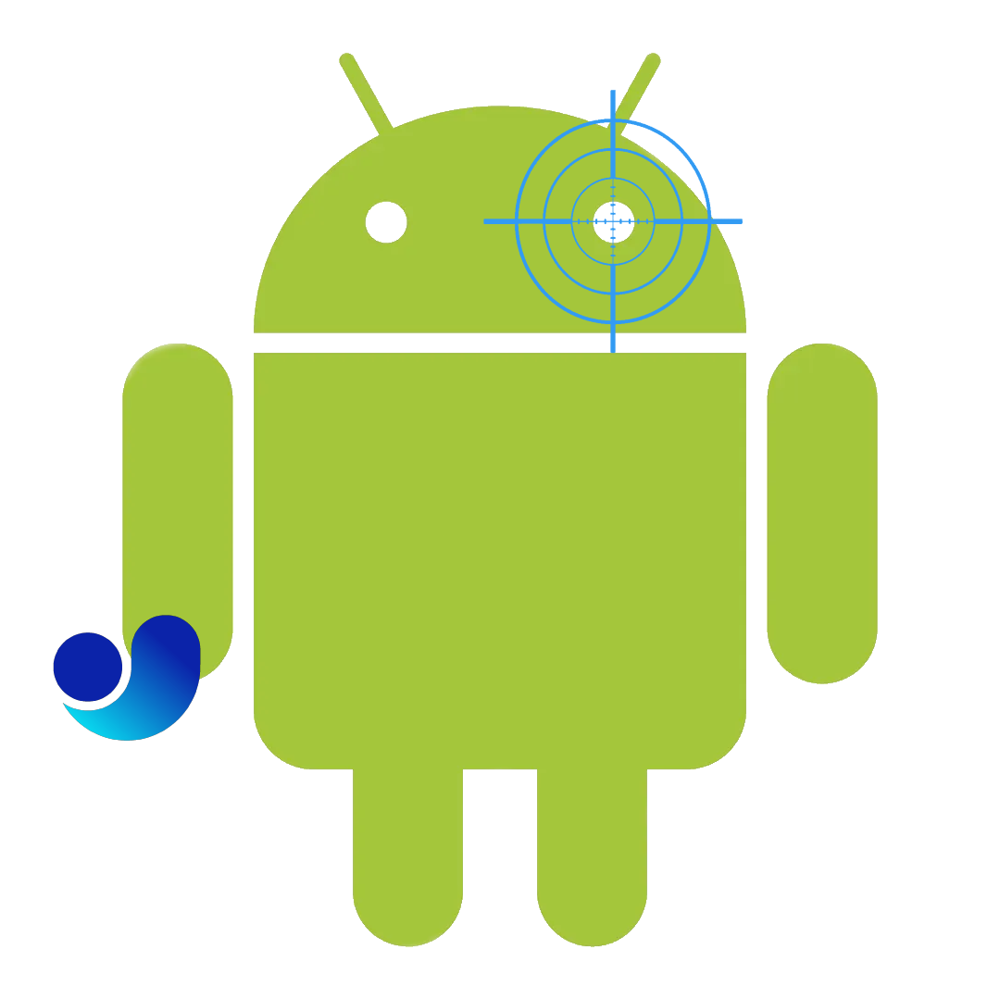

<div align="center">

  
# MobileAiimer
### An [AI-Aimbot](https://github.com/RootKit-Org/AI-Aimbot) fork running on a phone.

</div>

<details>
<summary>Flow Chart</summary>

</details>

## Todo:
- [ ] Hook into scripting interface

- [ ] use ffmpeg to capture output

- [ ] forward stream over adb tcp

- [ ] configure port and stream settings inside obs

> ### Windows
>> ```%AppData%\obs-studio\basic\scripts\```

> ### Linux/Mac
>> ```~/.config/obs-studio/basic/scripts/```

## Example Usage
* Open obs ~> Tools ~> Scripts

* “+” ~> load script

* Click Start
  
## Configuration

* Video source

* Port

* Bitrate

## Termux Setup

```bash
pkg install ffmpeg
adb forward tcp:5000 tcp:5000
```

```bash
echo debug
ffplay -fflags nobuffer tcp://127.0.0.1:5000
```

